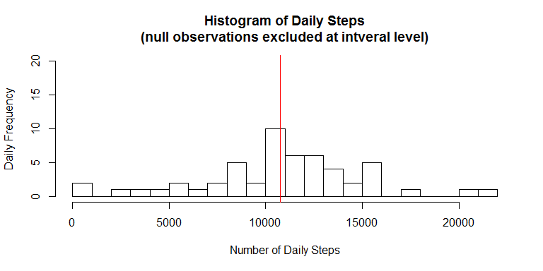
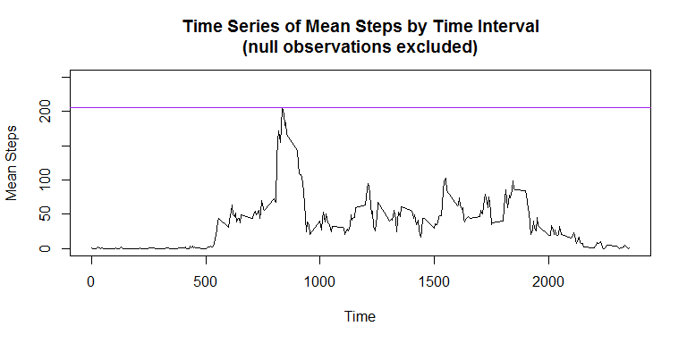
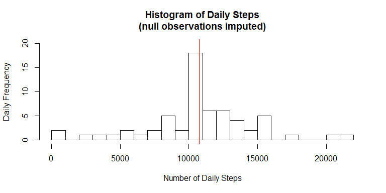
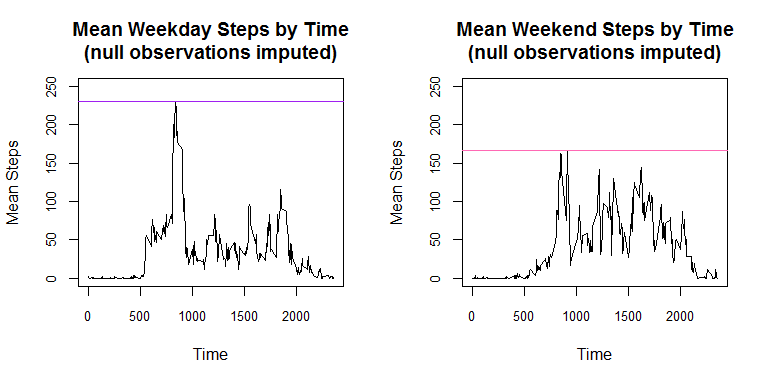

# Reproducible Research: Peer Assessment 1


## Loading and preprocessing the data
First we load the personal activity monitoring dataset, which is located in the same repository as this documentation.


```r
data <- read.table(unz("activity.zip", "activity.csv"), nrows = 17568, header = TRUE, sep = ",", na.strings = "NA")
```

The only real preprocessing required for the data is to update the `date` column with the appropriate datatype.  After this, our dataset is ready for some analysis.


```r
data$date <- as.Date(data$date)
```


## What is the mean total number of steps taken per day?
The first question we are interested in answering relates to the total number of steps recorded each day within the dataset.  Since we are going to be manipulating this data in a few different ways, we load the `dplyr` package to take advantage of its convenient capabilities.


```r
library(dplyr)
```

Upon inspection, we see that 2,304 observations are null.  We also see that when null observations **do** occur, they span the entire day (there are 12 five-minute time intervals each hour, multiplied by 24 hours for a total of 288 observations each day).  The first few rows of that verification are shown below.  Therefore, we don't have to worry about any days that have steps recorded for only a **portion** of that day.  Going forward, we want to be sure to handle these null observations appropriately as we analyze our data.


```r
sum(is.na(data$steps))
```

```
## [1] 2304
```

```r
head(table(data$date, is.na(data$steps)), 10)
```

```
##             
##              FALSE TRUE
##   2012-10-01     0  288
##   2012-10-02   288    0
##   2012-10-03   288    0
##   2012-10-04   288    0
##   2012-10-05   288    0
##   2012-10-06   288    0
##   2012-10-07   288    0
##   2012-10-08     0  288
##   2012-10-09   288    0
##   2012-10-10   288    0
```

Now that we understand our data in terms of its null observations, we first group our dataset by `date` and then create a new summarized dataset, `dataDaily`, which contains the sum of the steps taken for each day present in the original dataset.  This summarization will attempt to include null values, which will result in a null **total** for each day having a null observation.  If we used `na.rm = TRUE` in the `sum()` formula, days with all null step observations, which is what we have, would result in 0 steps for the entire day, which technically isn't correct since the total is actually **unknown**, not zero.  If we leave `na.rm` to its default value of `FALSE`, days with null observations will result in an appropriate null step total.


```r
data      <- group_by(data, date)
dataDaily <- summarize(data, steps = sum(steps))
```

At this point, let's view our summarized dataset to better understand the distribution of the total number of steps observed each day.


```r
hist(dataDaily$steps,
     breaks = 25,
     ylim = c(0, 20),
     main = "Histogram of Daily Steps\n(null observations excluded at intveral level)",
     xlab = "Number of Daily Steps",
     ylab = "Daily Frequency")
abline(v = mean(dataDaily$steps, na.rm = TRUE),   col = "blue")
abline(v = median(dataDaily$steps, na.rm = TRUE), col = "red")
```




We have technically marked both the **mean** (<span style="color:blue">blue</span>, 10,766.19) and **median** (<span style="color:red">red</span>, 10,765) daily step total in the histogram above, although they are virtually identical on this scale and not distinctly visible from one another.  Since the mean and median measures must exclude any null values in order to be calculable, we must include `na.rm = TRUE` in each formula.


## What is the average daily activity pattern?
Now that we have a feel for how the observed daily step totals are centered and distributed, let's try to understand whether any trends or patterns exist over the course of a day by looking at the mean number of steps taken per time interval, over the course of time spanned by the dataset.  First we need to appropriately group and summarize the data to reflect mean step counts by time interval over all dates in the dataset.


```r
data         <- group_by(data, interval)
dataInterval <- summarize(data, meanSteps = mean(steps, na.rm = TRUE))
```

Let's plot these average steps-per-interval along the vertical axis while representing the time interval itself along the horizontal axis.


```r
with(dataInterval,
     plot(x = interval,
          y = meanSteps,
          type = "l",
          main = "Time Series of Mean Steps by Time Interval\n(null observations excluded)",
          xlab = "Time", ylab = "Mean Steps",
          ylim = c(0, 250)))
abline(h = max(dataInterval$meanSteps, na.rm = TRUE), col = "purple")
```




The mean step counts are a bit noisy, but we see the general activity trend over the course of the average day.  As a reminder, all null step observations were excluded.  We can see that the maximum mean number of steps observed in a single time interval (marked in <span style="color:purple">purple</span> above) takes place at 835, topping out at 206.17.  Subsetting our data as shown below specifically reveals how we find this intra-day maximum.


```r
dataInterval[which(dataInterval$meanSteps == max(dataInterval$meanSteps, na.rm = TRUE)), ]
```

```
## Source: local data frame [1 x 2]
## 
##   interval meanSteps
##      (int)     (dbl)
## 1      835  206.1698
```

## Imputing missing values
While we were able to identify the mean, median, and distribution of the daily step total earlier, we know that some observations were excluded as a result of their being null (2,304 of them, to be precise).  Missing values are often imputed when analyzing a dataset, and different approaches are possible.  We could simply impute the mean daily step total to any day whose observations were not recorded.  However, maybe we'd like to address the null observations in our original dataset, `data`, which contains observations at the time interval-level.  Since eliminating null values at the granular level provides additional flexibility, we will take this approach.

Let's start with the mean step counts by time interval that we used above.  A sample is shown here.


```r
head(dataInterval)
```

```
## Source: local data frame [6 x 2]
## 
##   interval meanSteps
##      (int)     (dbl)
## 1        0 1.7169811
## 2        5 0.3396226
## 3       10 0.1320755
## 4       15 0.1509434
## 5       20 0.0754717
## 6       25 2.0943396
```

We now look to replace the null values in our **original** dataset with the average number of steps validly observed throughout the rest of that dataset during the same time interval.  We do this by first merging the interval averages with the original dataset, joined on `interval`, then creating the `stepsImputed` column (via `dplyr`'s `mutate()` function), which contains the **actual** observation where it exists and the **mean** step total for that particular time interval where it doesn't.  We also remove the previously-merged `meanSteps` column in our call to `mutate()`, since we no longer need it.  Finally, the data is set back to its original ordering scheme (via `dplyr`'s `arrange()` function), first by date, then by time interval.


```r
data <- merge(data, dataInterval)
data <- mutate(data, stepsImputed = ifelse(is.na(steps), meanSteps, steps), meanSteps = NULL)
data <- arrange(data, date, interval)
```

At this point we can refresh the daily distribution analysis that we performed earlier, now that our null step counts have been updated with reasonable values substituted in their place.  First we create a new daily step total summary and update our histogram of daily step totals to see if anything looks different.


```r
data             <- group_by(data, date)
dataDailyImputed <- summarize(data, stepsImputed = sum(stepsImputed))

hist(dataDailyImputed$stepsImputed,
     breaks = 25,
     ylim = c(0, 20),
     main = "Histogram of Daily Steps\n(null observations imputed)",
     xlab = "Number of Daily Steps",
     ylab = "Daily Frequency")
abline(v = mean(dataDailyImputed$steps),   col = "blue")
abline(v = median(dataDailyImputed$steps), col = "red")
```




The difference between this refreshed histogram and the original is that there is a higher peak in the middle, corresponding to additional days now totaling the average daily number of steps available in our original dataset.  This makes sense given the way we imputed averages to observations that were originally null.  Again, we technically mark both the **mean** (<span style="color:blue">blue</span>, 10,766.19, unchanged from before) and **median** (<span style="color:red">red</span>, 10,766.19, which has slightly increased from before) daily step totals in the histogram above.  These measures do in fact result in the same exact value now, after our imputation.  It makes sense that the mean daily step count would remain the same since all we did was introduce more mean values to the data.  The original median was slightly lower than the mean, so by adding mean values it also makes sense that the revised median increased.  As a note, since no nulls remain in the original and therefore summarized datasets, the mean and median measures no longer require the `na.rm = TRUE` condition.


## Are there differences in activity patterns between weekdays and weekends?
Earlier, we analyzed the average number of steps taken across each time interval over the course of a day.  Then we used that data to impute values back to the original dataset where observations were null.  After having worked with this data in a couple of ways now, it's natural to wonder if this average daily activity looks different for weekdays than it does for weekends.

First, let's create an indicator as to whether each original observation is associated with a weekday or weekend, group the data by interval again, then split the data into two summarized datasets:  one describing weekdays and one describing weekends.  We'll also take advantage of the full set of step count observations that include imputed values for the original null observations.


```r
data                <- mutate(data, dayGroup = ifelse(weekdays.Date(date) %in% c("Saturday", "Sunday"), "Weekend", "Weekday"))
data                <- group_by(data, interval)
dataIntervalWeekday <- summarize(filter(data, dayGroup == "Weekday"), meanStepsImputed = mean(stepsImputed))
dataIntervalWeekend <- summarize(filter(data, dayGroup == "Weekend"), meanStepsImputed = mean(stepsImputed))
```

After creating our two datasets summarized by time interval, we look to visually compare the average step activity between weekdays and weekends.  We expect there to be some noise, similar to what we saw earlier, so instead of overlaying the two time series we'll plot them side-by-side, making sure to use the same vertical scale.

Using base graphics, we'll need to change our output to be formatted into a two-column matrix.  Since we only have two graphs to compare, one row is all we need.  We can accomplish this with the `mfcol` option within the `par()` function.  Afterward, all we need to do is generate our two plots for comparison.


```r
par(mfcol = c(1, 2))


with(dataIntervalWeekday,
     plot(x = interval,
          y = meanStepsImputed,
          type = "l",
          main = "Mean Weekday Steps by Time\n(null observations imputed)",
          xlab = "Time", ylab = "Mean Steps",
          ylim = c(0, 250),
          xaxt = "n",
          yaxt = "n"))
axis(c(1), cex.axis = 0.80)
axis(c(2), cex.axis = 0.80)
abline(h = max(dataIntervalWeekday$meanStepsImputed, na.rm = TRUE), col = "purple")

with(dataIntervalWeekend,
     plot(x = interval,
          y = meanStepsImputed,
          type = "l",
          main = "Mean Weekend Steps by Time\n(null observations imputed)",
          xlab = "Time", ylab = "Mean Steps",
          ylim = c(0, 250),
          xaxt = "n",
          yaxt = "n"))
axis(c(1), cex.axis = 0.80)
axis(c(2), cex.axis = 0.80)
abline(h = max(dataIntervalWeekend$meanStepsImputed, na.rm = TRUE), col = "hotpink")
```




Although the weekend data is noisier (simply as there are fewer observations included), there indeed is a different activity pattern on weekends versus weekdays.  We can see that the activity is shifted a bit later in the day, both in the morning and the evening.  We can also see that the activity has fewer distinct peaks on weekends, as being away from work allows for a more flexibility and less routine.  Finally, we see that the greatest average step activity at any one time interval is lower on the weekends (166.64) than on weekdays (230.38).  It also occurs slightly later in the morning too, at 915 as opposed to 835.  Given the different daily activity trends seen above, it may be desirable to incorporate the day of the week into our imputation process in the future.
